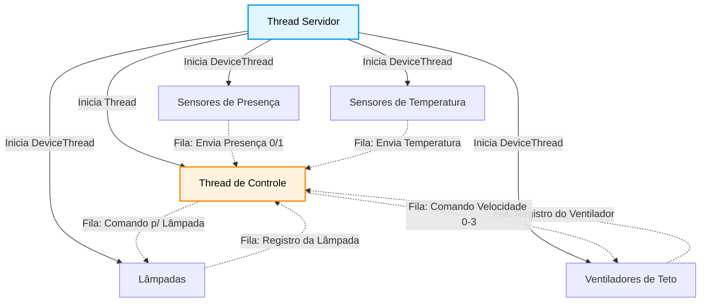
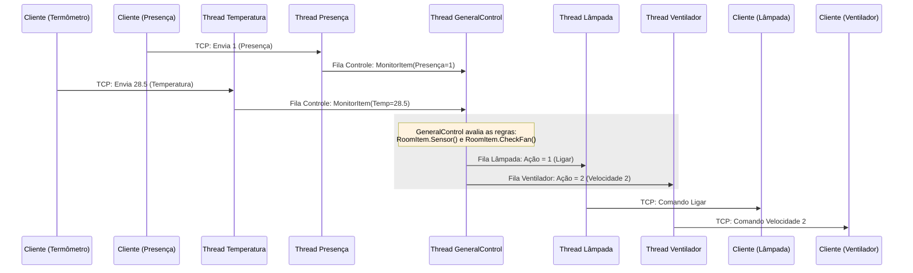
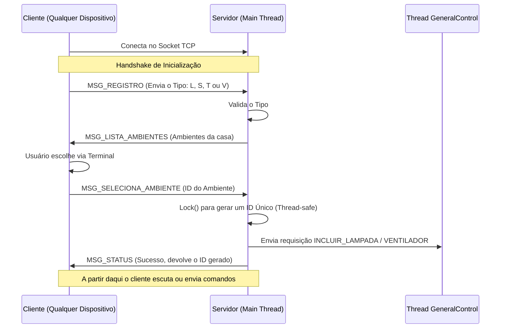

# Smart Home TCP Client/Server Application

Este repositório contém uma aplicação Client/Server desenvolvida em Python (3.6+) para simular um sistema de Smart Home utilizando sockets TCP. O sistema é composto por um servidor central multithread e diversos dispositivos clientes (Lâmpadas, Sensores de Presença e Termômetros). 

Abaixo, detalhamos o funcionamento do projeto correspondente à "Etapa 2", abordando os fundamentos, a arquitetura, o protocolo e um roteiro prático para testes.

---

## Fundamentos de Sockets TCP

Nesta aplicação, a comunicação entre o servidor e os dispositivos é estabelecida utilizando **Sockets TCP**. O protocolo TCP garante uma entrega confiável, ordenada e com verificação de erros entre as duas pontas da conexão. 

### Comportamento do Buffer TCP: Orientado a Stream vs. Mensagem
O TCP é um protocolo **orientado a fluxo de bytes (stream-oriented)** e não orientado a mensagens. Isso significa que ele não preserva os limites lógicos das mensagens enviadas pela aplicação. 

**O problema:** 
Quando uma ponta faz uma chamada `send()` com 15 bytes, a ponta receptora, ao chamar `recv()`, pode não receber exatamente esses 15 bytes de uma vez. Ela pode receber os 15 bytes juntos, pode receber apenas 5 bytes na primeira chamada e os 10 restantes numa próxima, ou até receber dados aglomerados de múltiplos comandos `send()` caso a latência da rede faça com que os pacotes sejam enfileirados juntos.

**A solução no código:**
Como 1 `send()` não garante 1 `recv()` correspondente na outra ponta, o código não pode assumir que os limites da mensagem estão no pacote recebido. Para reconstruir as mensagens de forma segura, o projeto implementa um **buffer acumulativo**.
1. O método `ReceiveMessage` lê dados da rede em blocos (ex: 1024 bytes) e anexa tudo no final do buffer do cliente (`device.buffer += dataBin`).
2. A função `getMessage(buffer)` examina o primeiro byte do buffer, que determina o **Código da Mensagem**.
3. Com o código, o sistema sabe o tamanho exato da mensagem esperada (ex: `MessageLamp` tem 14 bytes).
4. Se o buffer tem o tamanho esperado (ou mais), o código "fatia" (slice) exatamente os bytes necessários para reconstruir a mensagem estruturada (`buffer[:msgSize]`) e mantém o restante no buffer para a próxima extração. Se não tiver o tamanho, ele aguarda mais chamadas `recv()`.

---

## Arquitetura e Diagramas de Fluxo



O sistema adota um modelo Cliente-Servidor multithread, permitindo que vários dispositivos operem concorrentemente sem bloquear o processamento uns dos outros.

### As Threads do Sistema

1. **A Thread Principal (Main Thread)**:
   - Inicializa os dados (carrega ambientes e dispositivos suportados).
   - Fica responsável primariamente por criar o socket do servidor na porta TCP.
   - Entra em um loop eterno (`while True`) aguardando conexões (função `accept()`). Quando um novo dispositivo conecta, a Main Thread cria (spawn) uma thread dedicada a esse cliente.

2. **Threads Dedicadas de Clientes (DeviceThread)**:
   - Uma DeviceThread é criada no servidor para cada dispositivo que se conecta (Temperatura, Presença ou Lâmpada).
   - Ela roda uma máquina de estados (Inicializando -> Selecionando Ambiente -> Conectado).
   - Gerencia exclusivamente o ciclo de vida, a recepção e o envio das mensagens de um cliente específico.
   - Quando um erro ou desconexão ocorre, esta thread é finalizada, não afetando os outros clientes.

3. **Thread de Controle Geral (GeneralControl)**:
   - É o "cérebro" das interações lógicas da casa inteligente. 
   - Recebe eventos emitidos pelas threads de clientes (ex: um sensor de presença avisando que alguém entrou).
   - Possui as referências aos ambientes e sabe quais lâmpadas estão em qual cômodo.
   - Encaminha comandos específicos para os dispositivos (ex: mandando todas as lâmpadas de uma sala ligarem).

### Comunicação Inter-Thread e Filas (Queues)



Para garantir que múltiplas threads não manipulem as mesmas variáveis ao mesmo tempo (o que causaria "Race Conditions" e corrupção de memória), a comunicação entre a **DeviceThread** e a **GeneralControl** é feita via Filas **(`queue.Queue`)**. 
Filas são estruturas "Thread-Safe". 
- Quando uma DeviceThread de Presença detecta movimento, ela empacota a informação em um objeto e dá um `.put()` na Fila Geral de Controle.
- A GeneralControl fica paralisada (`.get()`) esperando novos dados na fila. Ao receber o aviso, processa e manda um `.put()` na fila individual da(s) respectiva(s) Lâmpada(s). A DeviceThread da Lâmpada, que estava esperando, lê a própria fila e manda o byte pela rede TCP para a lâmpada física (cliente) apagar ou acender.

---

## O Protocolo de Comunicação



O fluxo de mensagens entre cliente e servidor tem uma ordem fixa para registro e identificação, antes de começar a troca de dados operacionais.

### Fluxo de Registro
1. **Conexão TCP**: O cliente conecta ao servidor.
2. **Identificação de Tipo (`MSG_REGISTRO`)**: O cliente envia uma mensagem informando se é Lâmpada (1), Presença (2) ou Termômetro (3). 
3. **Validação e Retorno (`MSG_LISTA_AMBIENTES`)**: O servidor verifica. Sendo suportado, ele envia a lista de ambientes configurados (Salas, Quartos, etc.).
4. **Alocação de Cômodo (`MSG_SELECIONA_AMBIENTE`)**: O usuário, via terminal do cliente, digita onde instalar o dispositivo. O cliente informa a escolha ao servidor.
5. **Geração de ID e Confirmação (`MSG_STATUS`)**: O servidor atrela o dispositivo ao cômodo, gera um ID único gerido através de um Lock (garantindo thread-safety na geração de IDs incrementais), e devolve informando sucesso. O ID único acompanhará todas as mensagens dali em diante.

### Formato do Payload Fixo e Tamanhos (Empacotamento)
O envio é convertido via o pacote `struct` em binário na formatação Big-Endian de rede (`!`). Os dados se alinham a múltiplos de 1 byte. As três primeiras informações presentes em toda mensagem são:
- **Código da Mensagem (`B`)**: `unsigned char` = 1 byte.
- **Timestamp (`d`)**: `double` (Datetime) = 8 bytes.

As mensagens mudam o resto da estrutura baseando-se no Código. Exemplo de uma mensagem de Leitura (`MSG_SENSOR` - totalizando 17 bytes):
1. (1 byte) Código da Mensagem (5)
2. (8 bytes) Timestamp (DataHora unix)
3. (4 bytes) Device ID (`I`, `unsigned int`)
4. (4 bytes) Valor Lido (`f`, `float`)

Isso deixa o parser TCP totalmente previsível com bytes de posições muito claras.

---

## Roteiro Detalhado de Testes

Siga os passos abaixo na ordem para validar todas as funcionalidades descritas de acordo com a Etapa 2.

### 1. Inicializando o Servidor
1. Abra um terminal de comando no diretório do projeto.
2. Certifique-se de que possui os arquivos `ambientes.txt` e `dispositivos.txt` configurados na mesma pasta.
3. Inicie o servidor:
   ```bash
   python Server.py
   ```
4. O servidor informará no log que carregou as tabelas, iniciou o controle, abriu as portas e está `"Aguardando conexões dos dispositivos..."`

> [Insert Screenshot: Server Initialization]

### 2. Registrando Dispositivos (Clientes)
Mantenha o servidor aberto. Para cada dispositivo, abra **um novo terminal** para rodá-lo (rodaremos 3 processos paralelos separados).

**Registrando a Lâmpada:**
1. No segundo terminal, execute:
   ```bash
   python Cliente_Lampada.py
   ```
2. O sistema pedirá que você escolha um ambiente e digitar o seu ID baseado na lista oferecida (ex: 1 para Sala de Estar).
3. A Lâmpada será conectada e registrada, e passará a aguardar comandos do servidor.

**Registrando o Sensor de Presença:**
1. No terceiro terminal, execute:
   ```bash
   python Cliente_Presenca.py
   ```
2. Siga o fluxo escolhendo **o mesmo ambiente** da Lâmpada (ex: Sala de Estar) para que consigamos testar a automação entre eles.

**Registrando o Termômetro:**
1. No quarto terminal, execute:
   ```bash
   python Cliente_Temperatura.py
   ```
2. Escolha o ambiente e observe no console que o termômetro se registra com sucesso.

> [Insert Screenshot: Clients Connection and Registration Flow]

### 3. Simulando Ações Ambientais (Automação)
Vamos simular que alguém entrou na sala e ver o reflexo na lâmpada.

1. No terminal do **Sensor de Presença**, digite `1` (Presença detectada) e pressione `Enter`.
2. Observe o terminal do **Sensor de Presença**: Deve indicar confirmação de `"Leitura recebida pelo servidor!!!"`
3. Observe o terminal do **Servidor**: Mostrará o processamento da fila de controle recebendo a mudança e instruindo a lâmpada do cômodo.
4. Observe o terminal da **Lâmpada**: A mensagem `"LAMPADA LIGADA"` e `"Acionamento recebido do servidor!!!"` deve ser exibida no console.
5. Volte no **Sensor de Presença**, digite `0` (Presença não detectada).
6. Olhe novamente a **Lâmpada**: `"LAMPADA DESLIGADA"`.

**Testando Termostato:**
1. No terminal do **Termômetro**, informe o valor: `24.5` e pressione `Enter`.
2. O Servidor acusará recebimento do log de temperatura e o cliente acusará a leitura recebida.

> [Insert Screenshot: Presence triggering the Lamp and Server Logging]

### 4. Testando Dispositivos Não Suportados e Falhas
O sistema possui regras para falhas e encerramentos.

1. Se você utilizar um Cliente informando um tipo não listado no `dispositivos.txt`, o Servidor imediatamente notará a falha na validação no fluxo de registro (`MSG_REGISTRO`).
2. O Servidor responderá via `MSG_STATUS` o código `5` (Tipo de dispositivo não suportado).
3. O Servidor dropará a comunicação logo na sequência (`connection.close()`), isolando o dispositivo inválido sem travar a Main Thread.
4. A mensagem de erro esperada, no cliente que enviar este dado corrompido ou ID não reconhecido é receber uma impressão no terminal de falha (e em caso de comandos inesperados, ele será desconectado e finalizará).

> [Insert Screenshot: Disconnection of unsupported device]

---
*Para encerrar os processos a qualquer momento, utilize `CTRL+C` nos terminais respectivos do Servidor e de cada Cliente.*
